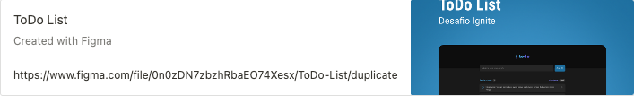

   

  

  

  
  

## Sobre o desafio 🚀

O Desafio consiste em desenvolver uma aplicação de controle de tarefas no estilo **to-do list**, que contém as seguintes funcionalidades:

- Adicionar uma nova tarefa
- Marcar e desmarcar uma tarefa como concluída
- Remover uma tarefa da listagem
- Mostrar o progresso de conclusão das tarefas

Para realizar a tarefa precisa relembrar conceitos como:

- Estados
- Imutabilidade do estado
- Listas e chaves no ReactJS
- Propriedades
- Componentização

### Acessando o layout do app 🚀

Para ter acesso e duplicar o Layout do desafio basta clicar no link abaixo. Ele adicionará o Layout à sua dashboard do Figma automaticamente, como uma cópia e abrirá o layout da aplicação para a sua visualização.

---

Created with 💜 by <a href="https://www.linkedin.com/in/eduardoqueiros/">Eduardo Queirós</a> :wave:
